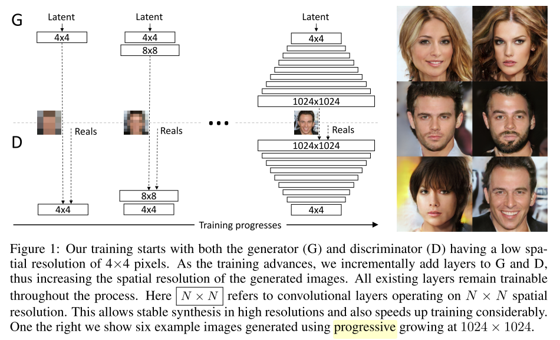
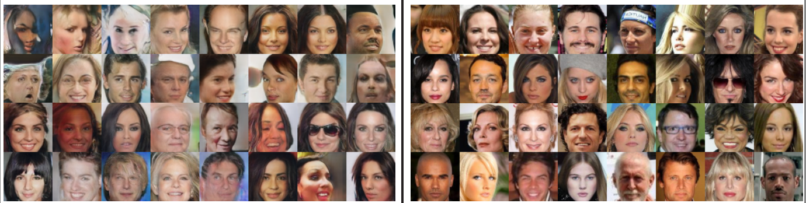

# PGGAN-tensorflow
the Tensorflow implementation of [PROGRESSIVE GROWING OF GANS FOR IMPROVED QUALITY, STABILITY, AND VARIATION](https://arxiv.org/abs/1710.10196).

## The generative process of PG-GAN


## Differences with the original paper.

## Setup

### Prerequisites

- TensorFlow 1.1
- python 2.7

### Getting Started
- Clone this repo:
```bash
git clone https://github.com/zhangqianhui/PGGAN-tensorflow
cd PGGAN-tensorflow
```
- Download the CelebA dataset

You can download the [CelebA dataset](https://www.dropbox.com/sh/8oqt9vytwxb3s4r/AAB06FXaQRUNtjW9ntaoPGvCa?dl=0) 
and unzip CelebA into a directory. Noted that this directory don't contain the sub-directory.

- Train the model
```bash
python main.py --path your data-path
```

## Results
Here is the results generated from this implementation:



## Issue
 If you find the bug and problem, Thanks for your issue to propose it.
    
## Reference code

[PGGAN Theano](https://github.com/tkarras/progressive_growing_of_gans)

[PGGAN Pytorch](https://github.com/github-pengge/PyTorch-progressive_growing_of_gans)
